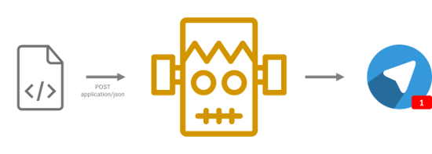

# webhook2telegram
(formerly _telegram-middleman-bot_)

[](https://liberapay.com/muety/)
[](https://saythanks.io/to/n1try)

[](https://goreportcard.com/report/github.com/muety/telegram-middleman-bot)
[](https://sonarcloud.io/dashboard?id=muety_telegram-middleman-bot)
[](https://sonarcloud.io/dashboard?id=muety_telegram-middleman-bot)
[](https://sonarcloud.io/dashboard?id=muety_telegram-middleman-bot)
[](https://sonarcloud.io/dashboard?id=muety_telegram-middleman-bot)

[](https://buymeacoff.ee/n1try)

---



A [Telegram Bot](https://telegram.me/MiddleManBot) to translate simple JSON HTTP requests into Telegram push messages that you will get on your Smartphone, PC or whatever Telegram client you have. Just like [Gotify](https://gotify.net/), but without an extra app.

## Changelog
### 2020-11-01
* Project was renamed from _telegram-middleman-bot_ to _webhook2telegram_

### 2020-04-05
* Integration with [Webmention.io](https://webmention.io)

### 2020-03-26
* ⚠️ `alertmanager` inlet was renamed  to `alertmanager_webhook` and its endpoint has changed accordingly
* Docker support, thanks to [luza](https://github.com/luza)
* Integration with Bitbucket, thanks to [luza](https://github.com/luza)

### 2020-03-10
* Major code refactorings
* Support for Inlets (see below)
* Integration with Prometheus Alertmanager

### 2019-11-06
Thanks to contributions by [peet1993](https://github.com/peet1993).
* Introduced explicit IPv6 support 
* Introduced ability to specify network address to bind to

## Why might this be useful?
This is especially useful for __developers or sysadmins__. Imagine you want some kind of reporting from your application or server, like a daily report including some statistics. You don't want to actively look it up on a website but you want to receive it in a __passive fashion__. Just like getting an e-mail. But come on, let's be honest. __E-Mails are so 2010__. And they require your little server-side script to include some SMTP library and connect to a mail server. That's __too heavyweight__ just to __get some short information__. Personally, I have a Python script running on my server which gathers some statistics from log files and databases and regularly sends me a Telegram message.

If you develop those thoughts further, this could potentially __replace any kind of e-mail notifications__ - be it the message that someone has answered to your __forum post__, your favorite game is __now on sale at Steam__, and so on. It's __lightweight and easy__, unlike e-mails that have way too much overhead.

## How to run it?
You can either set up your own instance or use mine, which is running at [https://apps.muetsch.io/webhook2telegram](https://apps.muetsch.io/webhook2telegram). The hosted instance only allows for a maximum of 240 requests per recipient per day. If you want to set this up on your own, do the following. You can either run the bot in long-polling- or webhook mode. For production use the latter option is recommended for [various reasons](https://core.telegram.org/bots/webhooks). However, you'll need a server with a static IP and s (self-signed) SSL certificate. 
1. Make sure you have the Go >= 1.13 installed.
2. `export GO111MODULE=on`
3. `go get github.com/muety/webhook2telegram`
4. `cd $GOPATH/src/github.com/muety/webhook2telegram`
5. `go build`

### Using long-polling mode
1. `./webhook2telegram --token <TOKEN_YOU_GOT_FROM_BOTFATHER> --port 8080` (of course you can use a different port)

### Using webhook mode 
1. If you don't have an official, verified certificate, create one doing `openssl req -newkey rsa:2048 -sha256 -nodes -keyout bot.key -x509 -days 365 -out bot.pem` (the CN must match your server's IP address)
2. Tell Telegram to use webhooks to send updates to your bot. `curl -F "url=https://<YOUR_DOMAIN_OR_IP>/api/updates" -F "certificate=@<YOUR_CERTS_PATH>.pem" https://api.telegram.org/bot<TOKEN_YOU_GOT_FROM_BOTFATHER>/setWebhook`
3. `./webhook2telegram --token <TOKEN_YOU_GOT_FROM_BOTFATHER> --mode webhook --certPath bot.pem --keyPath bot.key --port 8443 --useHttps` (of course you can use a different port)

Alternatively, you can also use a __reverse proxy__ like _nginx_ or [_Caddy_](https://caddyserver.com) to handle encryption. In that case you would set the `mode` to _webhook_, but `useHttps` to _false_ and your bot wouldn't need any certificate.

### Additional parameters
* `--address` (`string`) – Network address (IPv4) to bind to. Default to `127.0.0.1`.
* `--address6` (`string`) – Network address (IPv6) to bind to. Default to `::1`.
* `--disableIPv6` (`bool`) – Whether or not to disable listening on both IPv4 and IPv6 interfaces. Default to `false`.
* `--proxy` (`string`) – Proxy connection string to be used for long-polling mode. Defaults to none.
* `--rateLimit` (`int`) – Maximum number of messages to be delivered to each recipient per hour. Defaults to `10`.

## How to use it?
1. You need to get a token from the bot. Send a message with `/start` to the [Webhook2Telegram Bot](https://telegram.me/MiddleManBot) therefore.
2. Now you can use that token to make HTTP POST requests to `http://localhost:8080/api/messages` (replace localhost by the hostname of your server running the bot or mine as shown above) with a body that looks like this.

```
{
	"recipient_token": "3edf633a-eab0-45ea-9721-16c07bb8f245",
	"text": "*Hello World!* (yes, this is Markdown)",
	"type": "TEXT",
	"origin": "My lonely server script"
}
```

**NOTE:** If the field *type* is omitted then the `TEXT` type will be used as default, though this is not recommended as this may change in future versions.

More details are available [here](/inlets).

### Inlets
Inlets provide a mechanism to pre-process incoming data that comes in a format different from what is normally expected by the bot. 

This is especially useful if data is sent by external, third-party applications which you cannot modify.

For instance, you might want to deliver alerts from [Prometheus' Alertmanager](https://prometheus.io/docs/alerting/alertmanager/) as Telegram notifications. However, Alertmanager's [webhook requests](https://prometheus.io/docs/alerting/configuration/#webhook_config) look much different from WH2TG's default input format. To still make them fit, you can write an [Inlet](/inlets) to massage the data accordingly.

To directly address an inlet, request `http://localhost:8080/api/inlets/<inlet_name>`. Note that `/api/inlets/default` is equivalent to `/api/messages`.

Following inlets are currently available:

| Name         | Description                                                                                                 | Status |
|--------------|-------------------------------------------------------------------------------------------------------------|--------|
| `default`      | Simply passes the request through without any changes                                                       | ✅      |
| `alertmanager_webhook` | Consumes [Alertmanager webhook requests](https://prometheus.io/docs/alerting/configuration/#webhook_config) | ✅      |
| `bitbucket_webhook` | Accepts [Bitbucket webhook requests](https://confluence.atlassian.com/bitbucket/tutorial-create-and-trigger-a-webhook-747606432.html) to notify about a pipeline status change | ⏳      |
| `webmentionio_webhook` | Accepts [Webmention.io](https://webmention.io/) webhook requests to notify about a new Webmention of one of your articles | ✅      |

Further documentation about the individual inlets is available [here](/inlets).

## License
MIT @ [Ferdinand Mütsch](https://muetsch.io)
